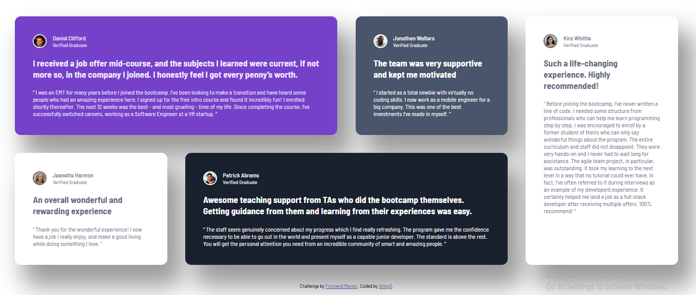

# Frontend Mentor - Testimonials grid section solution

This is a solution to the [Testimonials grid section challenge on Frontend Mentor](https://www.frontendmentor.io/challenges/testimonials-grid-section-Nnw6J7Un7). Frontend Mentor challenges help you improve your coding skills by building realistic projects.

## Table of contents

- [Overview](#overview)
  - [The challenge](#the-challenge)
  - [Screenshot](#screenshot)
  - [Links](#links)
- [My process](#my-process)
  - [Built with](#built-with)
  - [What I learned](#what-i-learned)
  - [Continued development](#continued-development)
- [Author](#author)

## Overview

### The challenge

Users should be able to:

- View the optimal layout for the site depending on their device's screen size

### Screenshot

### Links

- Solution URL: [https://github.com/ibitoy3/Testimonial-Grid-Section](https://your-solution-url.com)
- Live Site URL: [https://ibitoy3.github.io/Testimonial-Grid-Section/](https://your-live-site-url.com)

## My process

### Built with

- Semantic HTML5 markup
- Flexbox
- CSS Grid

### What I Learned

I gianed first hand experience on the use of CSS Grid, and I honestly still can't pick a favourite between it and Flex, but I now have a sense of their individual limitatios and can make a well informed decision on what to use, depending on what I aim to get.

### Continued development

I will be looking to further make use of rems and ems units of measurements for styling, while gaining better understanding as I use it.

## Author

- Frontend Mentor - [@ibitoy3](https://www.frontendmentor.io/profile/ibitoy3)
